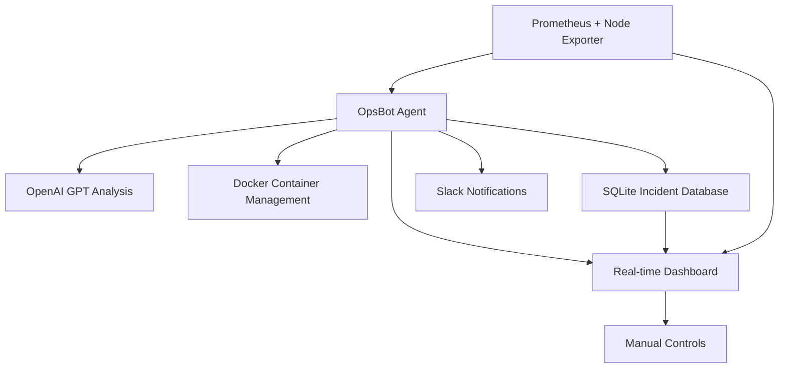

# DevOpsAgent

# 🤖 OpsBot - Intelligent DevOps Monitoring Agent

[](https://www.python.org/downloads/)
[](https://docs.docker.com/get-docker/)
[](https://opensource.org/licenses/MIT)

An autonomous DevOps monitoring agent that detects system anomalies, performs root cause analysis using AI, and automatically remediates issues. Built with real-time monitoring, intelligent alerting, and a comprehensive web dashboard.

## 🏗️ Architecture Overview



## ✨ Key Features

### 🔍 **Intelligent Monitoring**
- **Real-time CPU monitoring** via Prometheus metrics
- **Configurable alert thresholds** (default: 80% CPU)
- **Historical trend analysis** with interactive charts
- **Automated anomaly detection** with pattern recognition

### 🧠 **AI-Powered Analysis**
- **Root cause analysis** using OpenAI GPT models
- **Log analysis and correlation** for incident diagnosis
- **Intelligent remediation suggestions** based on system patterns
- **Natural language incident reporting**

### 🔧 **Automated Remediation**
- **Container restart automation** when issues detected
- **Service health verification** post-remediation
- **Escalation to human operators** when auto-fix fails
- **Cooldown periods** to prevent remediation loops

### 📊 **Comprehensive Dashboard**
- **Real-time metrics visualization** with Plotly charts
- **Live CPU usage graphs** with historical trends
- **Incident timeline and details** with searchable history
- **Manual control panel** for testing and overrides
- **System health indicators** and container status

### 📈 **Enterprise Features**
- **Incident tracking database** with full audit trail
- **Slack/Teams integration** for team notifications
- **Export capabilities** for compliance and reporting
- **Multi-container monitoring** support
- **Configurable monitoring intervals** and thresholds

## 📁 Project Structure

```
DevOpsAgent/
├── 📂 src/                          # Source code
│   ├── 🐍 opsbot.py                 # Main monitoring agent
│   ├── 🌐 ui.py                     # Streamlit dashboard
│   ├── ⚙️ config.py                 # Configuration settings
│   └── 🛠️ utils.py                  # Utility functions
├── 📂 data/                         # Data storage
│   ├── 📊 ui_data.json              # Real-time status data
│   └── 🗄️ incidents.db             # SQLite incident database
├── 📂 logs/                         # Log files
│   └── 📝 syslog.log                # System logs for analysis
├── 🐳 docker-compose.yml            # Prometheus & Node Exporter
├── 🐳 Dockerfile                    # OpsBot containerization
├── ⚙️ prometheus.yml                # Prometheus configuration
├── 📋 requirements.txt              # Python dependencies
├── 🚀 run.sh                        # Startup script
├── 🧪 test_monitoring.sh            # Testing utilities
├── 📚 README.md                     # This file
└── 🔐 .env                          # Environment variables (create this)
```

## 🛠️ Installation & Setup

### Prerequisites

- **Python 3.8+** with pip
- **Docker & Docker Compose** for containerization
- **Ubuntu/Linux environment** (tested on Ubuntu 22.04)
- **OpenAI API key** for log analysis
- **Slack webhook URL** for notifications (optional)

### Quick Start

#### 1. Clone and Setup
```bash
# Clone the repository
git clone <your-repo-url>
cd DevOpsAgent

# Create virtual environment
python3 -m venv venv
source venv/bin/activate

# Install dependencies
pip install -r requirements.txt
```

#### 2. Configure Environment
```bash
# Create environment configuration
cat > .env << 'EOF'
export OPENAI_API_KEY="sk-your-openai-api-key-here"
export SLACK_WEBHOOK_URL="https://hooks.slack.com/services/YOUR/SLACK/WEBHOOK"
export CPU_THRESHOLD="80"
export CONTAINER_NAME="test-container"
EOF

# Load environment variables
source .env
```

#### 3. Start Infrastructure
```bash
# Start Prometheus and Node Exporter
docker-compose up -d

# Verify services are running
docker-compose ps
```

#### 4. Launch OpsBot
```bash
# Make scripts executable
chmod +x run.sh test_monitoring.sh

# Start the complete system
./run.sh
```

#### 5. Access Interfaces
- **📊 OpsBot Dashboard**: http://localhost:8501
- **📈 Prometheus UI**: http://localhost:9090
- **🐳 Docker Containers**: `docker ps`

## 📋 Dependencies & Libraries

### Core Dependencies

| Library | Version | Purpose | Documentation |
|---------|---------|---------|---------------|
| **prometheus-api-client** | 0.5.3 | Prometheus metrics integration | [PyPI](https://pypi.org/project/prometheus-api-client/) |
| **openai** | ≥1.0.0 | AI-powered log analysis | [OpenAI Docs](https://platform.openai.com/docs) |
| **streamlit** | ≥1.28.0 | Web dashboard framework | [Streamlit Docs](https://docs.streamlit.io/) |
| **requests** | ≥2.28.0 | HTTP client for notifications | [Requests Docs](https://requests.readthedocs.io/) |

### Visualization & Data Processing

| Library | Version | Purpose | Documentation |
|---------|---------|---------|---------------|
| **plotly** | ≥5.0.0 | Interactive charts and graphs | [Plotly Docs](https://plotly.com/python/) |
| **pandas** | ≥1.5.0 | Data manipulation and analysis | [Pandas Docs](https://pandas.pydata.org/docs/) |
| **numpy** | ≥1.21.0 | Numerical computing for statistics | [NumPy Docs](https://numpy.org/doc/) |

### System & Database

| Library | Purpose | Built-in | Documentation |
|---------|---------|----------|---------------|
| **sqlite3** | Incident database storage | ✅ Python built-in | [SQLite Docs](https://docs.python.org/3/library/sqlite3.html) |
| **subprocess** | Container management | ✅ Python built-in | [Subprocess Docs](https://docs.python.org/3/library/subprocess.html) |
| **json** | Data serialization | ✅ Python built-in | [JSON Docs](https://docs.python.org/3/library/json.html) |
| **time** | Timing and scheduling | ✅ Python built-in | [Time Docs](https://docs.python.org/3/library/time.html) |
| **os** | Operating system interface | ✅ Python built-in | [OS Docs](https://docs.python.org/3/library/os.html) |
| **signal** | Process signal handling | ✅ Python built-in | [Signal Docs](https://docs.python.org/3/library/signal.html) |

### Docker & Infrastructure

| Component | Purpose | Configuration |
|-----------|---------|---------------|
| **Prometheus** | Metrics collection and storage | `prometheus.yml` |
| **Node Exporter** | System metrics export | Docker Compose |
| **Alpine Linux** | Lightweight test containers | Runtime dependency |

## ⚙️ Configuration

### Environment Variables

| Variable | Required | Default | Description |
|----------|----------|---------|-------------|
| `OPENAI_API_KEY` | Yes | - | OpenAI API key for log analysis |
| `SLACK_WEBHOOK_URL` | No | - | Slack webhook for notifications |
| `CPU_THRESHOLD` | No | 80 | CPU usage threshold for alerts (%) |
| `CONTAINER_NAME` | No | test-container | Target container for monitoring |

### Prometheus Configuration

```yaml
# prometheus.yml
global:
  scrape_interval: 15s

scrape_configs:
  - job_name: 'node-exporter'
    static_configs:
      - targets: ['node-exporter:9100']
```

### Application Settings

```python
# Configurable in src/opsbot.py
MONITORING_INTERVAL = 30      # seconds between checks
DURATION = 120               # incident duration threshold
SPIKE_SIMULATION_CHANCE = 0.1  # 10% chance for demo spikes
```

## 🚀 Usage Guide

### Starting the System

```bash
# Option 1: Full automated startup
./run.sh

# Option 2: Manual startup
source .env
docker-compose up -d
cd src
python3 opsbot.py &
streamlit run ui.py &
```

### Monitoring Operations

```bash
# Check system status
./test_monitoring.sh

# View real-time logs
tail -f opsbot.log

# Monitor processes
watch 'ps aux | grep -E "opsbot|streamlit"'

# Check Docker containers
docker ps -a
```

### Testing & Validation

```bash
# Simulate CPU spike
curl -X POST "http://localhost:8501/simulate_spike"

# Manual container restart
docker restart test-container

# View incident history
sqlite3 data/incidents.db "SELECT * FROM incidents ORDER BY id DESC LIMIT 5;"
```

### Stopping the System

```bash
# Graceful shutdown
pkill -f 'opsbot\.py|streamlit'

# Stop Docker services
docker-compose down

# Force cleanup
sudo pkill -f 'opsbot|streamlit'
```

## 📊 Dashboard Features

### Real-time Monitoring
- **Live CPU Usage**: Current percentage with color-coded status
- **Historical Charts**: Interactive Plotly graphs with zoom/pan
- **Alert Indicators**: Visual warnings when thresholds exceeded
- **System Statistics**: Min/max/average calculations

### Incident Management
- **Incident Timeline**: Chronological list of all detected issues
- **Root Cause Analysis**: AI-generated explanations for each incident
- **Remediation History**: Actions taken and their outcomes
- **Manual Controls**: Emergency buttons for immediate intervention

### Configuration Panel
- **Threshold Adjustment**: Real-time CPU alert threshold changes
- **Refresh Settings**: Configurable auto-refresh intervals
- **Time Range Selection**: Historical data viewing periods
- **Export Options**: Data download in JSON format

## 🔧 Troubleshooting

### Common Issues

#### ❌ "Prometheus connection failed"
```bash
# Check if Prometheus is running
docker-compose ps
curl http://localhost:9090

# Restart if needed
docker-compose restart prometheus
```

#### ❌ "OpenAI API error"
```bash
# Verify API key is set
echo $OPENAI_API_KEY

# Test API connection
curl https://api.openai.com/v1/models \
  -H "Authorization: Bearer $OPENAI_API_KEY"
```

#### ❌ "No incidents displayed"
```bash
# Check if OpsBot is running
ps aux | grep opsbot.py

# Verify database exists
ls -la data/incidents.db

# Check database contents
sqlite3 data/incidents.db "SELECT COUNT(*) FROM incidents;"
```

#### ❌ "Dashboard not updating"
```bash
# Check Streamlit process
ps aux | grep streamlit

# Verify data file updates
watch 'cat data/ui_data.json'

# Restart dashboard
pkill streamlit
streamlit run src/ui.py
```

### Performance Tuning

```python
# Adjust monitoring frequency (opsbot.py)
MONITORING_INTERVAL = 60  # Increase for less frequent checks

# Reduce historical data range (ui.py)
time_hours = 0.5  # Show only 30 minutes of history

# Lower auto-refresh rate (ui.py)
refresh_interval = 30  # Refresh every 30 seconds
```

### Log Analysis

```bash
# OpsBot operation logs
tail -f opsbot.log

# Streamlit application logs
tail -f streamlit.log

# System operation history
tail -f run.log

# Prometheus logs
docker-compose logs prometheus
```

## 🧪 Testing & Validation

### Automated Testing

```bash
# Run comprehensive tests
./test_monitoring.sh

# Expected outputs:
# ✅ OpsBot process found
# ✅ Streamlit dashboard found
# ✅ UI data file exists
# ✅ Incidents database exists
# ✅ Test container running
```

### Manual Testing Scenarios

#### 1. CPU Spike Detection
```bash
# Simulate high CPU usage
stress --cpu 8 --timeout 60s

# Expected: Alert in dashboard, incident logged
```

#### 2. Container Restart
```bash
# Test remediation
docker stop test-container

# Expected: OpsBot detects and restarts container
```

#### 3. Dashboard Responsiveness
```bash
# Test real-time updates
watch 'curl -s http://localhost:8501'

# Expected: Data updates every 10 seconds
```

### Performance Benchmarks

| Metric | Expected Value | Actual |
|--------|---------------|--------|
| Detection Time | < 60 seconds | ⏱️ |
| Remediation Time | < 30 seconds | 🔧 |
| Dashboard Load | < 3 seconds | 📊 |
| Memory Usage | < 500 MB | 💾 |

## 🔒 Security Considerations

### API Key Management
```bash
# Store securely in .env file
echo "OPENAI_API_KEY=sk-..." >> .env

# Never commit to version control
echo ".env" >> .gitignore

# Use environment-specific keys
export OPENAI_API_KEY_PROD="sk-prod-key"
export OPENAI_API_KEY_DEV="sk-dev-key"
```

### Network Security
```yaml
# Limit Prometheus access (docker-compose.yml)
prometheus:
  ports:
    - "127.0.0.1:9090:9090"  # Local access only

# Secure Streamlit dashboard
streamlit:
  command: streamlit run ui.py --server.address 127.0.0.1
```

### Container Security
```bash
# Run containers with limited privileges
docker run --user 1000:1000 --read-only ...

# Use security-scanned images
docker run --security-opt no-new-privileges ...
```

## 📈 Performance & Scaling

### Resource Requirements

| Component | CPU | Memory | Disk | Network |
|-----------|-----|--------|------|---------|
| OpsBot Agent | 0.1 cores | 128 MB | 100 MB | Low |
| Streamlit UI | 0.1 cores | 256 MB | 50 MB | Medium |
| Prometheus | 0.2 cores | 512 MB | 1 GB | Medium |
| Node Exporter | 0.1 cores | 64 MB | 10 MB | Low |

### Scaling Considerations

```python
# Monitor multiple containers
CONTAINERS = ["app-1", "app-2", "app-3"]

# Distribute monitoring load
MONITORING_WORKERS = 3

# Implement caching for metrics
METRIC_CACHE_TTL = 30  # seconds
```

## 🤝 Contributing

### Development Setup

```bash
# Clone for development
git clone <repo-url>
cd DevOpsAgent

# Install development dependencies
pip install -r requirements-dev.txt

# Run tests
python -m pytest tests/

# Code formatting
black src/
flake8 src/
```

### Contribution Guidelines

1. **Fork the repository** and create a feature branch
2. **Write tests** for new functionality
3. **Follow PEP 8** coding standards
4. **Update documentation** for changes
5. **Submit pull request** with detailed description

### Feature Roadmap

- [ ] **Multi-cloud support** (AWS, Azure, GCP)
- [ ] **Machine learning** anomaly detection
- [ ] **Custom metric** support beyond CPU
- [ ] **Mobile dashboard** responsiveness
- [ ] **API endpoints** for external integration
- [ ] **Role-based access** control
- [ ] **Grafana integration** for advanced visualization

## 📄 License

This project is licensed under the MIT License - see the [LICENSE](LICENSE) file for details.

```
MIT License

Copyright (c) 2025 OpsBot DevOps Agent

Permission is hereby granted, free of charge, to any person obtaining a copy
of this software and associated documentation files (the "Software"), to deal
in the Software without restriction, including without limitation the rights
to use, copy, modify, merge, publish, distribute, sublicense, and/or sell
copies of the Software, and to permit persons to whom the Software is
furnished to do so, subject to the following conditions:

The above copyright notice and this permission notice shall be included in all
copies or substantial portions of the Software.
```

## 🆘 Support & Contact

### Getting Help

- **📖 Documentation**: Check this README and inline code comments
- **🐛 Bug Reports**: Create an issue with detailed reproduction steps
- **💡 Feature Requests**: Open an issue with use case description
- **❓ Questions**: Use GitHub Discussions for community support

### Maintainers

- **Primary Maintainer**: [Your Name](mailto:your.email@domain.com)
- **Contributors**: See [CONTRIBUTORS.md](CONTRIBUTORS.md)

### Acknowledgments

- **Prometheus Team** for excellent metrics platform
- **Streamlit Team** for intuitive dashboard framework
- **OpenAI** for powerful language models
- **Docker Community** for containerization standards

---

## 🚀 Quick Command Reference

```bash
# 🏁 Start Everything
./run.sh

# 📊 Access Dashboard
open http://localhost:8501

# 🔍 Check Status
./test_monitoring.sh

# 📝 View Logs
tail -f opsbot.log

# 🛑 Stop Everything
pkill -f 'opsbot\.py|streamlit'
docker-compose down
```

**Ready to monitor like a pro! 🤖✨**
